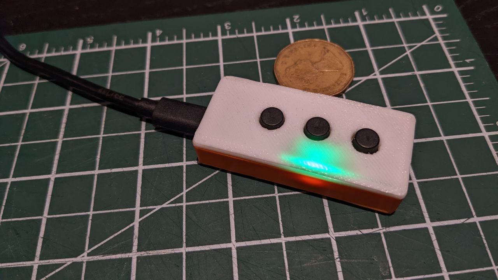
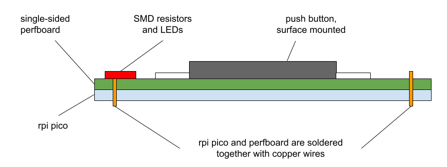
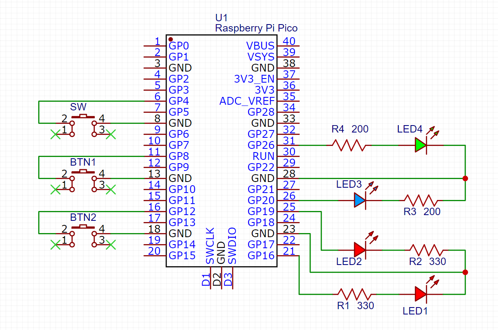
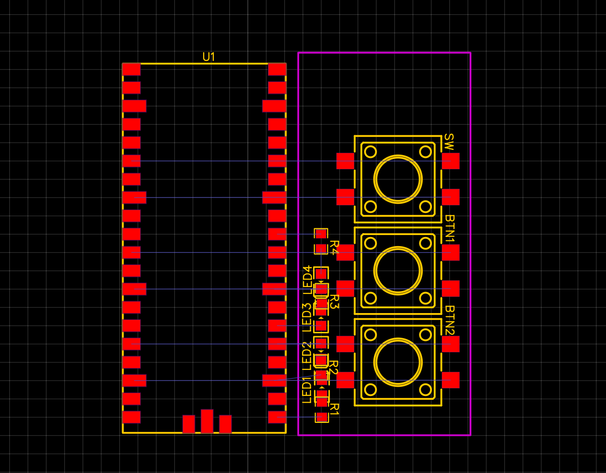
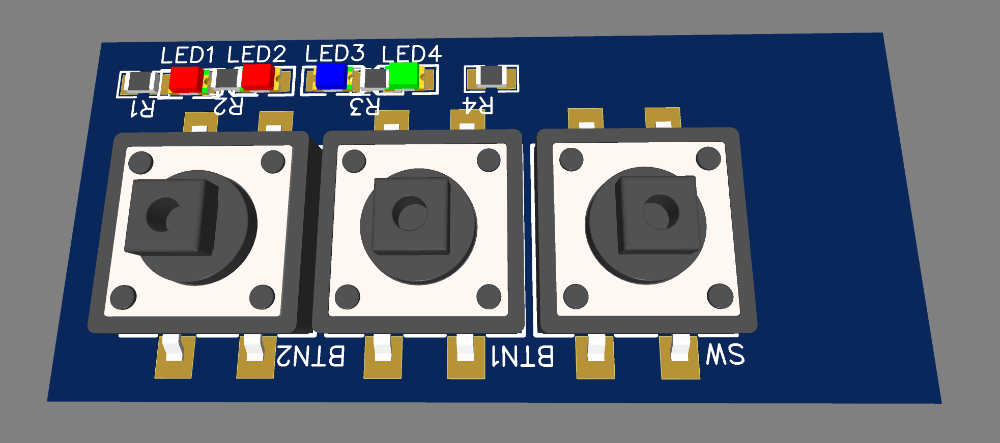
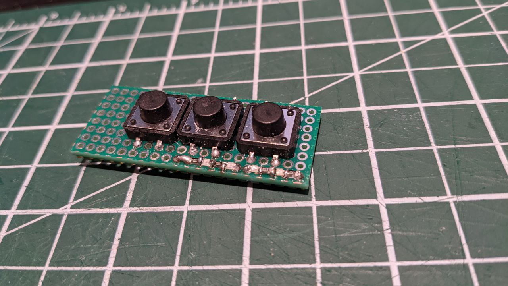

RPi-Pico based Macro Keyboard
========================================

This is the design of a macro keyboard based on Raspberry Pi Pico.

## Features

- Compact design, 56mm x 26mm x 14mm after assembly
- 3-button macro keyboard
- support up to 4 devices
- support up to 2 macros per device

## Hardware

- Raspberry Pi Pico
- 3x 12x12mm push buttons
- single-sided perfboard (at least 21mm x 52mm)

## Software

- CircuitPython (tested with 8.1.0)

## Installation

The main goal is to make the keyboard as small as possible. Therefore, a single-sided perfboard is chosen
so that it can be sandwiched between the Pico and the buttons. The Pico is soldered directly to the perfboard.
The buttons are soldered to the perfboard.

The following diagram shows the assembly of the keyboard. The Pico is soldered to the perfboard with copper wires through the holes.
You can use the legs of resistors / LEDs as the wires. I used LED legs since they are strong enough to hold the Pico in place.

The following schematic shows the wiring of the keyboard.

The following diagram shows the layout of the components. The LEDs and resistors are 0805 SMD so that they can fit perfectly on the perfboard.

It might be clearer to see the layout in 3D view.

1. Cut the perfboard to the same size as the Pico, i.e. 21mm x 52mm. Make sure to align the holes with the Pico's holes.
2. Solder the Pico to the perfboard. Put the pico and the perfboard back-to-back, and use copper wires (LED legs) to bind them together. You don't need to solder all 40 holes; only the holes have connections need to be soldered.
3. Solder the push buttons to the perfboard. Note that you should follow the layout diagram above exactly. The buttons should be surface-mounted, since we are using single-sided perfboard. You can flatten the legs of the button and cut them to proper length so that they can be surface-mounted.
4. Solder the LEDs and resistors to the perfboard. Again, they should be surface-mounted.

The completed board should look like this:

### Programming

1. Download the latest CircuitPython UF2 file from https://circuitpython.org/board/raspberry_pi_pico/ , then install it to the Pico. I used 8.1.0, but other versions should work as well.
2. Download the libraries from https://circuitpython.org/libraries . Put the following libraries into the `lib` folder of the Pico.
   - `adafruit_hid`
3. Copy the `keyboard.py` to the Pico. Modify it to suit your needs. See the following section for details.
4. Once the `keyboard.py` can run correctly on the Pico, you can rename it to `code.py` so that it will be executed automatically when the Pico is powered on.
5. (optional) Copy the `boot.py` to the Pico. This will disable the Pico from connecting as a USB drive.

### How to define macros

By default, the `keyboard.py` use the first button as the switch between devices, and the other two buttons as the macros. It defines the following variables that can be used in the macros (`mode1_func()` to `mode4_func()`):

- `btn1`: the first button
- `btn2`: the second button
- `time_elapsed`: `int`, the time elapsed since connection, in seconds. Can be used to implement a timer.
- `kbd`: `Keyboard` object, can be used to send key presses. [doc](https://docs.circuitpython.org/projects/hid/en/latest/api.html#adafruit_hid.keyboard.Keyboard)
- `mouse`: `Mouse` object, can be used to send mouse events. [doc](https://docs.circuitpython.org/projects/hid/en/latest/api.html#adafruit_hid.mouse.Mouse)

